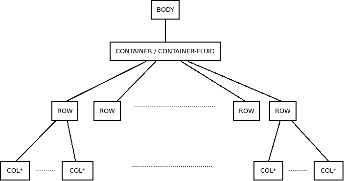

# El Grid de BootStrap

Como ya hemos hablado en el capítulo anterior es muy difícil que nos encontremos con páginas cuyos layouts sean tan complejos como para necesitar más de un contenedor. Así que, si nos ponemos de acuerdo en eso, en que sólo vamos a necesitar un contenedor, podemos fijar una estructura general que va a permanecer fijas para todos nuestros layouts:

Y dentro de cada fila de cada row, en principio podemos tener hasta 12 columnas, aunque ya veremos posteriormente que dado a que BootStrap 4 utiliza contenedores flex podemos usar las propiedades de estos contenedores flex para poner más columnas aunque, en realidad, es difícil que tengamos que utilizar más.

Todas estas columnas están pegadas unas a otras y tiene siempre un padding a izquierda y a derecha de 15px del que hablaremos posteriormente.

Otra cosa importante es que no tenemos que olvidarnos de utilizar *class="row"* ya que si nuestra estructura de columnas no está dentro de un contenedor con esa clase perderemos todas las propiedades de los contenedores flex, que son los sustentan la maquetación en BootStrap 4.
